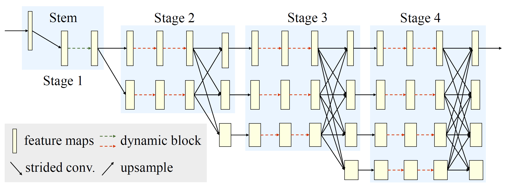
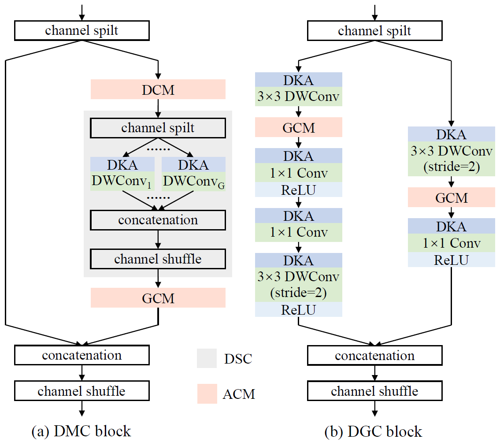

# Dite-HRNet: Dynamic Lightweight High-Resolution Network for Human Pose Estimation

## Introduction
This is an official PyTorch implementation of our IJCAI-ECAI 2022 paper [***Dite-HRNet: Dynamic Lightweight High-Resolution Network for Human Pose Estimation***](https://doi.org/10.24963/ijcai.2022/153). We present a Dynamic lightweight High-Resolution Network (Dite-HRNet), which can efficiently extract multi-scale contextual information and model long-range spatial dependency for human pose estimation. Specifically, we propose two methods, dynamic split convolution and adaptive context modeling, and embed them into two novel lightweight blocks, which are named Dynamic Multi-scale Context (DMC) block and Dynamic Global Context (DGC) block. These two blocks, as the basic component units of our Dite-HRNet, are specially designed for the high-resolution networks to make full use of the parallel multi-resolution architecture. Experimental results show that the proposed network achieves superior performance on both COCO and MPII human pose estimation datasets, surpassing the state-of-the-art lightweight networks.

- The Dite-HRNet architecture:



- The DMC block and DGC block:



## Models and results

#### Results on COCO `val2017` with detector having human AP of 56.4 on COCO `val2017` dataset

| Model                                                        | Input Size | #Params | FLOPs  |  AP   | AP<sup>50</sup> | AP<sup>75</sup> | AP<sup>M</sup> | AP<sup>L</sup> |  AR   | AR<sup>50</sup> | AR<sup>75</sup> | AR<sup>M</sup> | AR<sup>L</sup> |
| :----------------------------------------------------------- | :--------: | :-----: | :----: | :---: | :-------------: | :-------------: | :------------: | :------------: | :---: | :-------------: | :-------------: | :------------: | :------------: |
| [Dite-HRNet-18](/configs/top_down/dite_hrnet/coco/ditehrnet_18_coco_256x192.py) |  256x192   |  1.1M   | 209.8M | 0.659 |      0.873      |      0.740      |     0.632      |     0.716      | 0.721 |      0.916      |      0.793      |     0.683      |     0.776      |
| [Dite-HRNet-30](/configs/top_down/dite_hrnet/coco/ditehrnet_30_coco_256x192.py) |  256x192   |  1.8M   | 329.8M | 0.683 |      0.882      |      0.762      |     0.655      |     0.741      | 0.742 |      0.926      |      0.812      |     0.704      |     0.797      |
| [Dite-HRNet-18](/configs/top_down/dite_hrnet/coco/ditehrnet_18_coco_384x288.py) |  384x288   |  1.1M   | 471.8M | 0.690 |      0.880      |      0.760      |     0.655      |     0.755      | 0.750 |      0.922      |      0.814      |     0.708      |     0.810      |
| [Dite-HRNet-30](/configs/top_down/dite_hrnet/coco/ditehrnet_30_coco_384x288.py) |  384x288   |  1.8M   | 741.7M | 0.715 |      0.889      |      0.782      |     0.682      |     0.777      | 0.772 |      0.928      |      0.833      |     0.732      |     0.831      |

#### Results on MPII `val` dataset

| Model                                                        | Input Size | #Params | FLOPs  | PCKh@0.5 | PCKh@0.1 |
| :----------------------------------------------------------- | :--------: | :-----: | :----: | :------: | :------: |
| [Dite-HRNet-18](/configs/top_down/dite_hrnet/mpii/ditehrnet_18_mpii_256x256.py) |  256x256   |  1.1M   | 279.5M |  0.870   |  0.311   |
| [Dite-HRNet-30](/configs/top_down/dite_hrnet/mpii/ditehrnet_30_mpii_256x256.py) |  256x256   |  1.8M   | 439.5M |  0.876   |  0.317   |

## Environment

The code is developed and tested using python 3.6 and 8 GeForce RTX 3090 GPUs. Other python versions or GPUs are not fully tested.

#### Requirements

- Linux (Windows is not officially supported)
- Python 3.6+
- PyTorch 1.3+
- CUDA 9.2+ (If you build PyTorch from source, CUDA 9.0 is also compatible)
- GCC 5+
- [mmcv](https://github.com/open-mmlab/mmcv) (Please install the latest version of mmcv-full)
- Numpy
- cv2
- json_tricks
- [xtcocotools](https://github.com/jin-s13/xtcocoapi)

## Quick Start


### 1. Installation
<!-- The code is based on [MMPose](https://github.com/open-mmlab/mmpose).
You need clone the mmpose project and integrate the codes into mmpose first. -->

a. Install mmcv, we recommend you to install the pre-build mmcv as below.

```shell
pip install mmcv-full -f https://download.openmmlab.com/mmcv/dist/{cu_version}/{torch_version}/index.html
```

Please replace ``{cu_version}`` and ``{torch_version}`` in the url to your desired one. For example, to install the latest ``mmcv-full`` with ``CUDA 11.1`` and ``PyTorch 1.10.0``, use the following command:

```shell
pip install mmcv-full -f https://download.openmmlab.com/mmcv/dist/cu111/torch1.10.0/index.html
```

See [here](https://github.com/open-mmlab/mmcv#installation) for different versions of MMCV compatible to different PyTorch and CUDA versions.

Optionally you can choose to compile mmcv from source by the following command

```shell
git clone https://github.com/open-mmlab/mmcv.git
cd mmcv
MMCV_WITH_OPS=1 pip install -e .  # package mmcv-full, which contains cuda ops, will be installed after this step
# OR pip install -e .  # package mmcv, which contains no cuda ops, will be installed after this step
cd ..
```

**Important:** You need to run `pip uninstall mmcv` first if you have mmcv installed. If mmcv and mmcv-full are both installed, there will be `ModuleNotFoundError`.

b. Install build requirements

```shell
pip install -r requirements.txt
```

### 2. Prepare datasets

It is recommended to symlink the dataset root to `$DITE_HRNET/data`.
If your folder structure is different, you may need to change the corresponding paths in config files.

**For COCO dataset**, please download from [COCO download](http://cocodataset.org/#download), 2017 Train/Val is needed for COCO keypoints training and validation. [HRNet-Human-Pose-Estimation](https://github.com/HRNet/HRNet-Human-Pose-Estimation) provides person detection result of COCO val2017 to reproduce our multi-person pose estimation results. Please download from [OneDrive](https://1drv.ms/f/s!AhIXJn_J-blWzzDXoz5BeFl8sWM-) or [GoogleDrive](https://drive.google.com/drive/folders/1fRUDNUDxe9fjqcRZ2bnF_TKMlO0nB_dk?usp=sharing). Optionally, to evaluate on COCO test-dev2017, please download the [image-info](https://download.openmmlab.com/mmpose/datasets/person_keypoints_test-dev-2017.json).
Download and extract them under `$DITE_HRNET/data`, and make them look like this:

```
dite_hrnet
├── configs
├── models
├── tools
`── data
    │── coco
        │-- annotations
        │   │-- person_keypoints_train2017.json
        │   |-- person_keypoints_val2017.json
        │   |-- person_keypoints_test-dev-2017.json
        |-- person_detection_results
        |   |-- COCO_val2017_detections_AP_H_56_person.json
        |   |-- COCO_test-dev2017_detections_AP_H_609_person.json
        │-- train2017
        │   │-- 000000000009.jpg
        │   │-- 000000000025.jpg
        │   │-- 000000000030.jpg
        │   │-- ...
        `-- val2017
            │-- 000000000139.jpg
            │-- 000000000285.jpg
            │-- 000000000632.jpg
            │-- ...

```

**For MPII dataset**, please download from [MPII Human Pose Dataset](http://human-pose.mpi-inf.mpg.de/).
The original annotation files have been converted into json format. Please download them from [mpii_annotations](https://openmmlab.oss-cn-hangzhou.aliyuncs.com/mmpose/datasets/mpii_annotations.tar).
Extract them under `$DITE_HRNET/data`, and make them look like this:

```
dite_hrnet
├── configs
├── models
├── tools
`── data
    │── mpii
        |── annotations
        |   |── mpii_gt_val.mat
        |   |── mpii_test.json
        |   |── mpii_train.json
        |   |── mpii_trainval.json
        |   `── mpii_val.json
        `── images
            |── 000001163.jpg
            |── 000003072.jpg
            │-- ...

```

## Training and Testing
### 1. Training

All outputs (log files and checkpoints) will be saved to the working directory,
which is specified by `work_dir` in the config file.

By default we evaluate the model on the validation set after each epoch, you can change the evaluation interval by modifying the interval argument in the training config

```python
evaluation = dict(interval=5)  # This evaluate the model per 5 epoch.
```

According to the [Linear Scaling Rule](https://arxiv.org/abs/1706.02677), you need to set the learning rate proportional to the batch size if you use different GPUs or videos per GPU, e.g., lr=0.01 for 4 GPUs x 2 video/gpu and lr=0.08 for 16 GPUs x 4 video/gpu.

```shell
# train with a signle GPU
python tools/train.py ${CONFIG_FILE} [optional arguments]

# train with multiple GPUs
./tools/dist_train.sh ${CONFIG_FILE} ${GPU_NUM} [optional arguments]
```

Optional arguments are:

- `--work-dir ${WORK_DIR}`: Override the working directory specified in the config file.
- `--resume-from ${CHECKPOINT_FILE}`: Resume from a previous checkpoint file.
- `--no-validate`: Whether not to evaluate the checkpoint during training.
- `--gpus ${GPU_NUM}`: Number of gpus to use, which is only applicable to non-distributed training.
- `--gpu-ids ${GPU_IDS}`: IDs of gpus to use, which is only applicable to non-distributed training.
- `--seed ${SEED}`: Seed id for random state in python, numpy and pytorch to generate random numbers.
- `--deterministic`: If specified, it will set deterministic options for CUDNN backend.
- `--cfg-options CFG_OPTIONS`: Override some settings in the used config, the key-value pair in xxx=yyy format will be merged into config file. For example, '--cfg-options model.backbone.depth=18 model.backbone.with_cp=True'.
- `--launcher ${JOB_LAUNCHER}`: Items for distributed job initialization launcher. Allowed choices are `none`, `pytorch`, `slurm`, `mpi`. Especially, if set to none, it will test in a non-distributed mode.
- `--autoscale-lr`: If specified, it will automatically scale lr with the number of gpus by [Linear Scaling Rule](https://arxiv.org/abs/1706.02677).
- `LOCAL_RANK`: ID for local rank. If not specified, it will be set to 0.

Difference between `resume-from` and `load-from`:
`resume-from` loads both the model weights and optimizer status, and the epoch is also inherited from the specified checkpoint. It is usually used for resuming the training process that is interrupted accidentally.
`load-from` only loads the model weights and the training epoch starts from 0. It is usually used for finetuning.

Examples:

```shell
# train DiteHRNet-18 on COCO dataset with 8 GPUs
./tools/dist_train.sh configs/top_down/dite_hrnet/coco/ditehrnet_18_coco_256x192.py 8

# train DiteHRNet-18 on MPII dataset with 8 GPUs
./tools/dist_train.sh configs/top_down/dite_hrnet/mpii/ditehrnet_18_mpii_256x256.py 8
```

### 2. Testing
You can use the following commands to test a dataset.

```shell
# single-gpu testing
python tools/test.py ${CONFIG_FILE} ${CHECKPOINT_FILE} [--out ${RESULT_FILE}] [--fuse-conv-bn] \
    [--eval ${EVAL_METRICS}] [--gpu_collect] [--tmpdir ${TMPDIR}] [--cfg-options ${CFG_OPTIONS}] \
    [--launcher ${JOB_LAUNCHER}] [--local_rank ${LOCAL_RANK}]

# multi-gpu testing
./tools/dist_test.sh ${CONFIG_FILE} ${CHECKPOINT_FILE} ${GPU_NUM} [--out ${RESULT_FILE}] [--fuse-conv-bn] \
    [--eval ${EVAL_METRIC}] [--gpu_collect] [--tmpdir ${TMPDIR}] [--cfg-options ${CFG_OPTIONS}] \
    [--launcher ${JOB_LAUNCHER}] [--local_rank ${LOCAL_RANK}]
```

Note that the provided `CHECKPOINT_FILE` is either the path to the model checkpoint file downloaded in advance, or the url link to the model checkpoint.

Optional arguments:

- `RESULT_FILE`: Filename of the output results. If not specified, the results will not be saved to a file.
- `--fuse-conv-bn`: Whether to fuse conv and bn, this will slightly increase the inference speed.
- `EVAL_METRICS`: Items to be evaluated on the results. Allowed values depend on the dataset.
- `--gpu_collect`: If specified, recognition results will be collected using gpu communication. Otherwise, it will save the results on different gpus to `TMPDIR` and collect them by the rank 0 worker.
- `TMPDIR`: Temporary directory used for collecting results from multiple workers, available when `--gpu_collect` is not specified.
- `CFG_OPTIONS`: Override some settings in the used config, the key-value pair in xxx=yyy format will be merged into config file. For example, '--cfg-options model.backbone.depth=18 model.backbone.with_cp=True'.
- `JOB_LAUNCHER`: Items for distributed job initialization launcher. Allowed choices are `none`, `pytorch`, `slurm`, `mpi`. Especially, if set to none, it will test in a non-distributed mode.
- `LOCAL_RANK`: ID for local rank. If not specified, it will be set to 0.

Example:

```shell
# test DiteHRNet-18 on COCO (without saving the test results) dataset with 8 GPUS, and evaluate the mAP.
./tools/dist_test.sh configs/top_down/dite_hrnet/coco/ditehrnet_18_coco_256x192.py \
    checkpoints/SOME_CHECKPOINT.pth 8 \
    --eval mAP
```

### 3. Computing model complexity
You can use the following commands to compute the complexity of one model.
```shell
python tools/summary_network.py ${CONFIG_FILE} --shape ${SHAPE}
```

- `SHAPE`: Input size.

Example:

```shell
# compute the complexity of DiteHRNet-18 with 256x192 resolution input.
python tools/summary_network.py configs/top_down/dite_hrnet/coco/ditehrnet_18_coco_256x192.py \
    --shape 256 192 \
```

## Citation

If you find this project useful in your research, please consider cite:

```
@inproceedings{LiZXZB22,
  title={{Dite-HRNet}: Dynamic Lightweight High-Resolution Network for Human Pose Estimation},
  author={Qun Li and Ziyi Zhang and Fu Xiao and Feng Zhang and Bir Bhanu},
  booktitle={International Joint Conference on Artificial Intelligence (IJCAI)},
  pages = {1095-1101},
  year = {2022}
}
```

## Acknowledgement

Thanks to:

- [MMPose](https://github.com/open-mmlab/mmpose)
- [HRNet](https://github.com/HRNet/deep-high-resolution-net.pytorch)
- [Lite-HRNet](https://github.com/HRNet/Lite-HRNet)
